<div align="center" width="100%">
    
</div>

# Dockge

A fancy, easy-to-use and reactive self-hosted docker compose.yaml stack-oriented manager.

[](https://github.com/Ext745/dockge) [](https://github.com/Ext745/dockge/releases) [](https://github.com/Ext745/dockge/commits/master/)

## 🆕 What's new from upstream: darthrater78 2.3.x (included since this fork's v2.5.0)

Built on Louis's original design, [darthrater78/dockge](https://github.com/darthrater78/dockge) 2.3.0 adds a redesigned phone layout, a resizable stack list on desktop, port conflicts you can't miss, and a Compose Drift Check that works everywhere. Full list in [darthrater78's release notes](https://github.com/darthrater78/dockge#release-notes). This fork's own additions are in the "This fork — Ext745/dockge" section below.

**2.3.1** catches the port conflicts 2.3.0 could miss (ports set through `.env` variables, `compose.override.yaml`, port ranges) and checks your ports when you Save or Deploy a stack. [Release notes](https://github.com/darthrater78/dockge/releases/tag/v2.3.1)

<a id="mobile"></a>

### 📱 Mobile

On a phone, Dockge is built around one job: **find a stack → open it → edit it or act on it → watch what happens.**

<p align="center">
  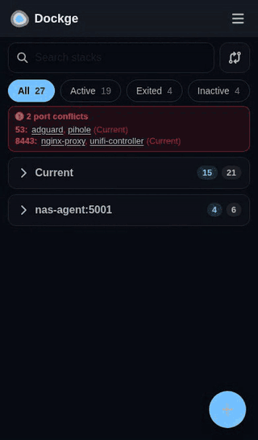
</p>

<table>
  <tr>
    <td align="center" width="33%">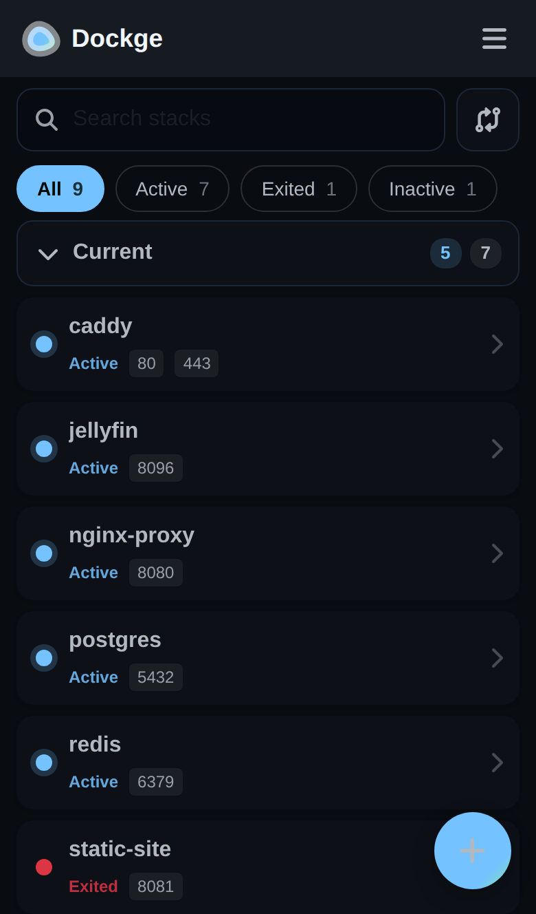<br /><b>Find</b></td>
    <td align="center" width="33%">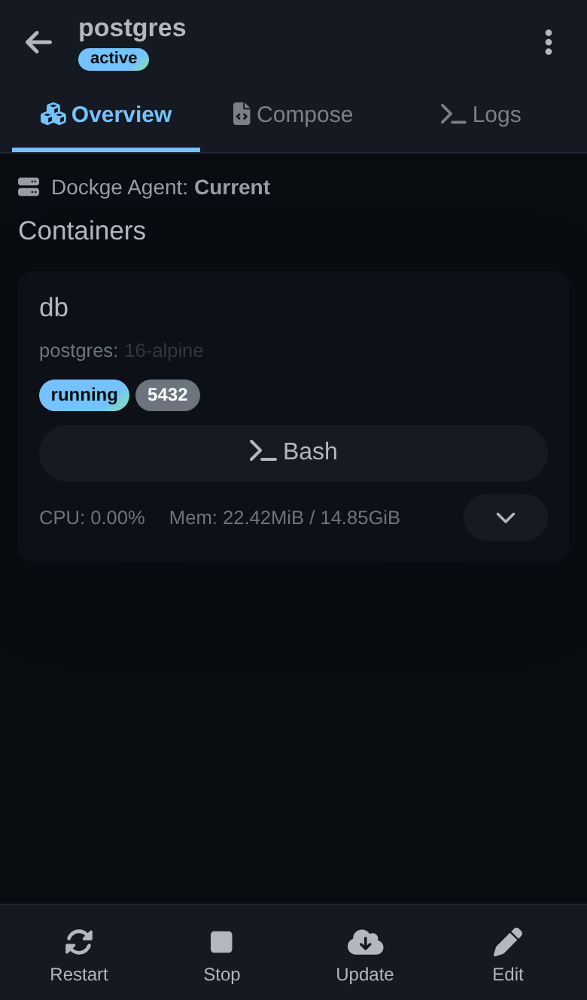<br /><b>Open</b></td>
    <td align="center" width="33%">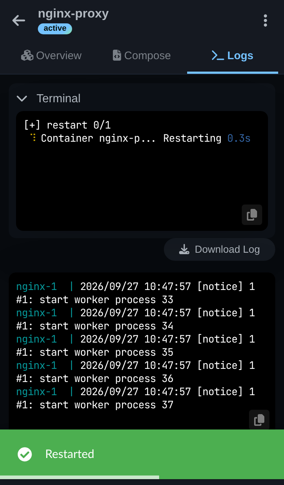<br /><b>Watch</b></td>
  </tr>
  <tr>
    <td align="center">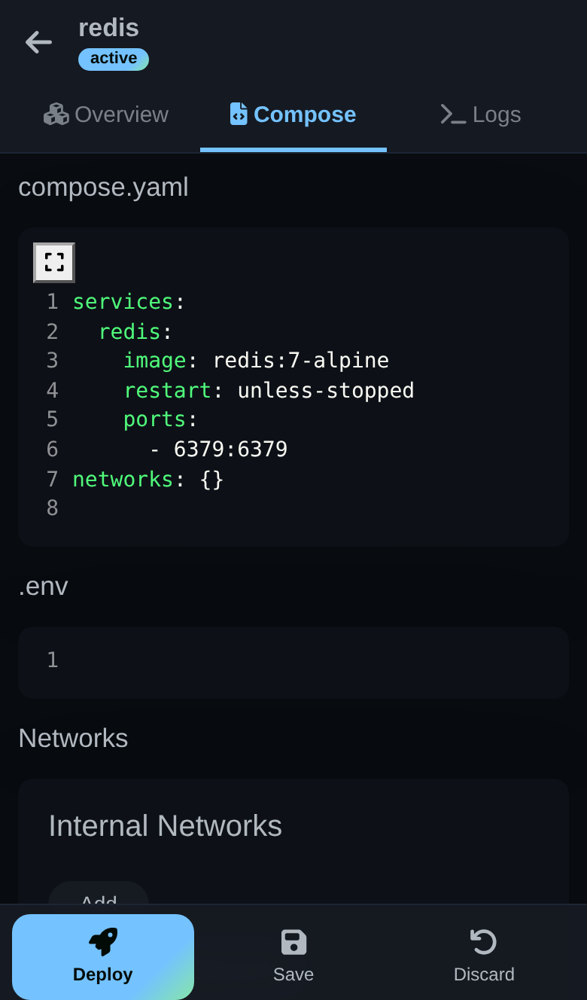<br /><b>Edit</b></td>
    <td align="center">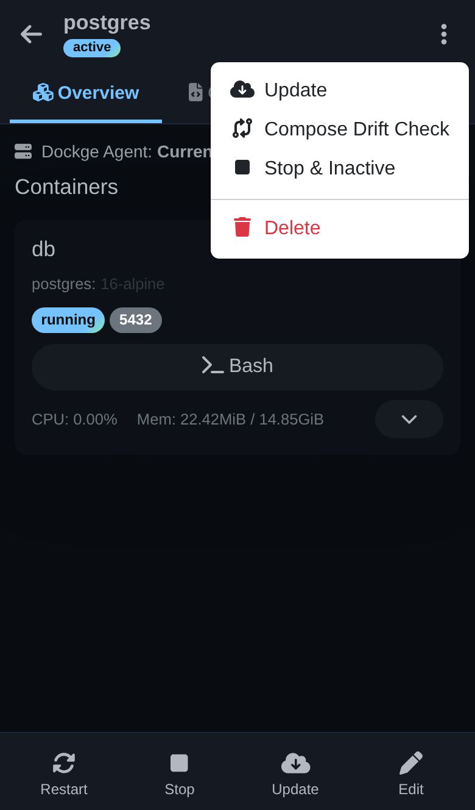<br /><b>More actions</b></td>
    <td align="center">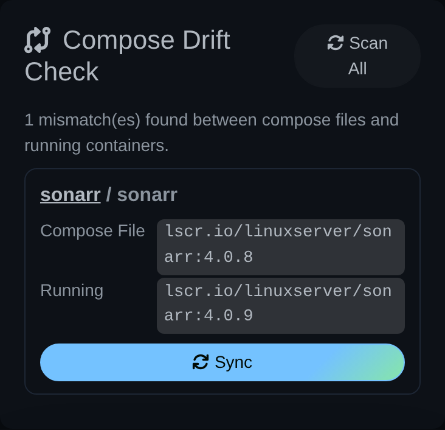<br /><b>Drift check</b></td>
  </tr>
</table>

- **The stack list is the home screen.** Search by stack name, agent or port; filter by status (Active / Exited / Inactive, with counts) or by **Port conflicts**. Each stack is one card: status, name and its host ports, conflicting ports first and in red.
- **One section per agent.** With more than one Dockge agent, stacks are grouped under a collapsible header per agent showing running / total counts. Sections start collapsed; searching or filtering opens them so matches are never hidden.
- **Port conflict banner** at the top of the list names each conflicting port and the stacks publishing it (tap a name to open that stack).
- **Stack page:** a top bar with back, name and status, and a ⋮ menu for the less common actions (Update, Compose Drift Check, Down, Delete). Three tabs:
  - **Overview:** which agent the stack runs on, its URLs, and each container with its status, ports and Bash / Restart / Stop.
  - **Compose:** `compose.yaml`, `.env` and `compose.override.yaml` when present.
  - **Logs:** the combined stack log, filling the screen (expandable to full screen).
- **Bottom action bar**, where your thumb is: **Start** or **Restart**, **Stop**, **Update**, **Edit**. While editing it becomes **Deploy**, **Save** and **Discard**. Any action switches to the Logs tab so you see its output live, and the tab shows a dot while it runs.
- **Menu (☰)** for Stacks, Overview, Compose Drift Check, Console, Settings, Scan Stacks Folder and Logout, so the bottom of the screen is free for the stack actions.
- **Compose Drift Check** is one tap away (the button beside the search box); on a phone its results are cards with the compose and running image and a Sync button.

<a id="desktop"></a>

### 🖥️ Desktop

**Resizable stack list.** Drag the handle between the stack list and the page to make the list wider or narrower (arrow keys work when the handle is focused; double-click resets it). The width is remembered. Port badges show as many ports as fit the current width, with the rest behind "+N", and a conflicting port is always shown first. When the list gets narrow, the Compose Drift Check button shrinks to its icon so the search box keeps its room.

<p align="center">
  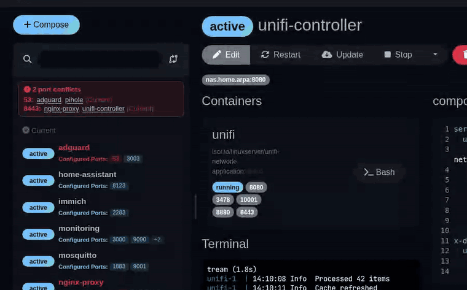
</p>

**Resizable terminals** (since 2.2.0). Every terminal panel (stack logs, console, container shell) has a drag handle to make it taller and a button to expand it to full screen; Esc restores it. Each page remembers its own height.

<p align="center">
  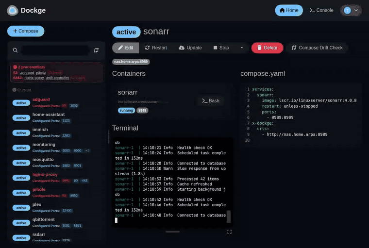
</p>

**Port conflicts at a glance.** The banner above the stack list lists every host port that more than one running stack publishes, per agent, with links to the stacks involved.

<p align="center">
  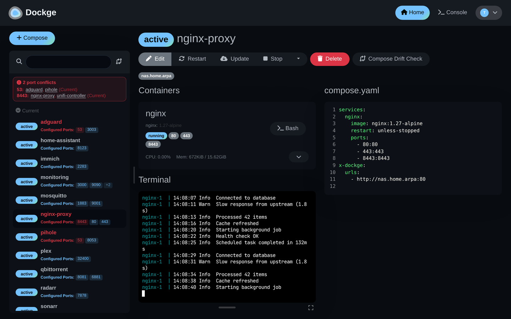
</p>

<a id="drift-check"></a>

### 🔄 Compose Drift Check

Compose Drift Check (added in this fork in 1.7.0) finds services whose `compose.yaml` pins a different image tag than the container actually running, and **Sync** writes the running tag back into the compose file (comments preserved). In 2.3.0:

- **"Scan All" no longer times out.** It used to run `docker ps` plus two `docker inspect` calls *per container, for every stack*, so any host with more than a handful of containers hit the 30-second limit. A scan now makes three docker calls in total and finishes in a couple of seconds.
- **On phones** it's one tap from the stack list (the button beside the search box, or ☰ → Compose Drift Check), and per stack from the ⋮ menu.
- **Results fit the space.** Each mismatch is a card (stack / service, compose image, running image, Sync) on phones and whenever the panel is too narrow for the table, so the Sync button is never scrolled out of view.

<table>
  <tr>
    <td align="center">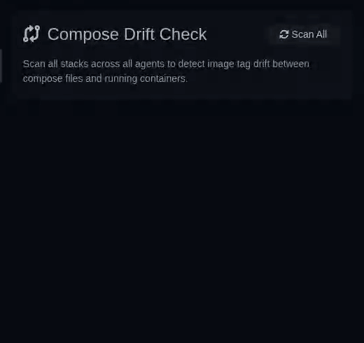<br /><b>Desktop:</b> Scan All, then Sync</td>
    <td align="center">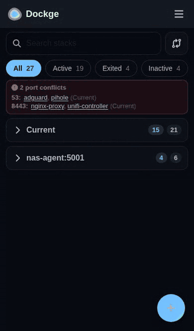<br /><b>Phone:</b> from the stack list</td>
  </tr>
</table>

---

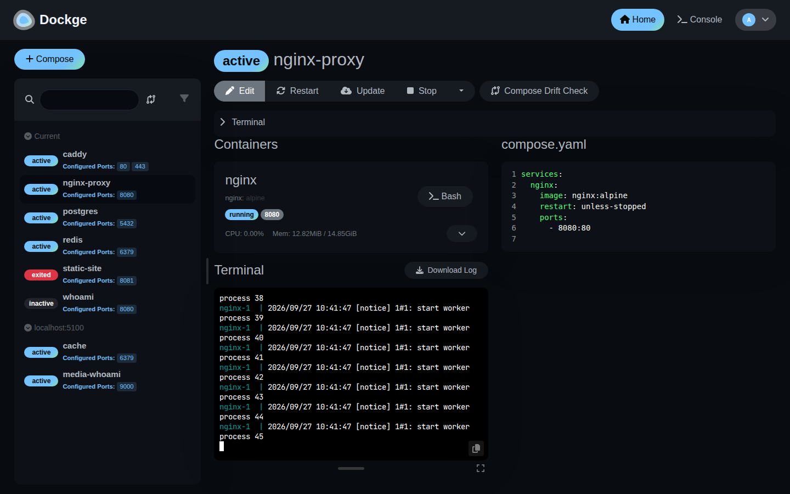

Original Dockge intro video (Louis Lam, shows the 2023 UI): https://youtu.be/AWAlOQeNpgU?t=48

---

## 🤖 Built by Claude Code

This is a fork of a fork. [darthrater78/dockge](https://github.com/darthrater78/dockge) — the base this repo builds on — had every line of its new code (from v1.5.2 through v2.3.1: REST API, Compose Drift Check, 2FA, port-conflict detection, CI hardening, the mobile redesign, and more) written by [Claude Code](https://claude.ai/code) under human direction, plus community PRs cherry-picked from [louislam/dockge](https://github.com/louislam/dockge) and its own fork collaborators. Full build history, the Dev Skills gate methodology, and contributor credits live in **[their README](https://github.com/darthrater78/dockge/blob/master/README.md)** — not duplicated here to keep this one short.

### This fork — [Ext745/dockge](https://github.com/Ext745/dockge)

On top of that base, [Claude Code](https://claude.ai/code) ported the following features from [hamphh/dockge 1.2](https://github.com/hamphh/dockge), a separate community fork, then closed out every remaining gap between the two:

| What was ported/added | Detail |
|---|---|
| **Agent Maintenance UI** | Container/image/network/volume listing per Docker agent, prune/prune-all/remove, image pull, live terminal streaming of Docker CLI output, multi-agent endpoint switching |
| **Ignore-service-status toggle** | `dockge.status.ignore=true` compose label excludes a service from a stack's aggregate running/exited status, on both the REST API and the dashboard's live status badge |
| **Fullscreen compose editor toggle** | Expand the primary `compose.yaml` editor (not just the override editor) into a fullscreen modal, synced via the same `v-model` |
| **Stack-terminal auto-collapse/auto-close** | The Compose page's progress terminal now opens on action and auto-hides ~10s after completion, matching the Agent Maintenance terminal's behavior |
| **Advanced category filter** | Filter the stack list by agent and status from a dropdown |
| **Delete-stack relocation** | Moved into the kebab (⋮) submenu, matching the rest of the per-stack destructive actions |
| **Node-to-node stack transfer** | Zip a stack, send it to another connected agent, deploy it there, then remove it from the source — moves a stack between hosts from the kebab menu. Ported from [NekoSuneProjectsForks/dockge](https://github.com/NekoSuneProjectsForks/dockge), with its RBAC-dependent access checks (a role system this fork doesn't have) dropped down to this fork's actual `checkLogin`-only auth model. Hardened after live-testing against real multi-agent setups: rolls back cleanly on a failed deploy (no orphaned containers or folders left behind), warns before moving a stack that uses named Docker volumes (their data isn't part of the transfer), handles larger stacks (raised the socket message-size limit), and the export → import → delete sequence now runs entirely server-side so it finishes even if the browser tab that started it closes |
| **Interactive progress terminal** | The Compose/Agent Maintenance progress terminal now forwards keystrokes, so `docker compose` `[y/N]` prompts and Ctrl+C work instead of hanging forever. Also from NekoSuneProjectsForks/dockge |
| **Auto-prune dangling images** | `Stack.update()` now prunes dangling images after a successful pull+up, so old layers don't pile up on every update |
| **Raw-keystroke host console** | The Console page now sends every keystroke straight to the shell instead of editing a line locally and sending it on Enter, so bash's own tab completion, Up/Down history, cursor editing, Ctrl+C and full-screen programs work. Same shell and same access as before (the console is still off unless `DOCKGE_ENABLE_CONSOLE=true`). Adapted from [Lorwell/dockge](https://github.com/Lorwell/dockge) commit `7a36b47` |
| **Update check that sees this fork** | "Show update if available" used to ask louislam's `dockge.kuma.pet/version` (which reports the 1.x line), so a 2.x install never saw an update. It now reads this fork's GitHub Releases (stable, plus pre-releases when "Also check beta release" is on), and Settings → About's "Check Update On GitHub" opens the releases page instead of a link pinned to the running version |

<table>
  <tr>
    <td align="center" width="40%">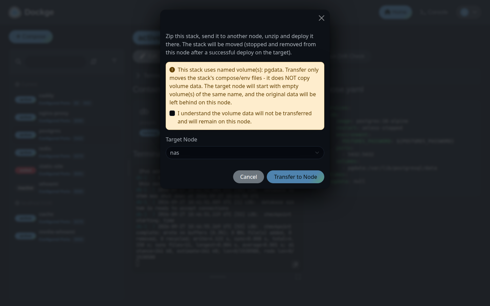<br /><b>Node-to-node transfer</b>, with the named-volume warning</td>
    <td align="center" width="40%">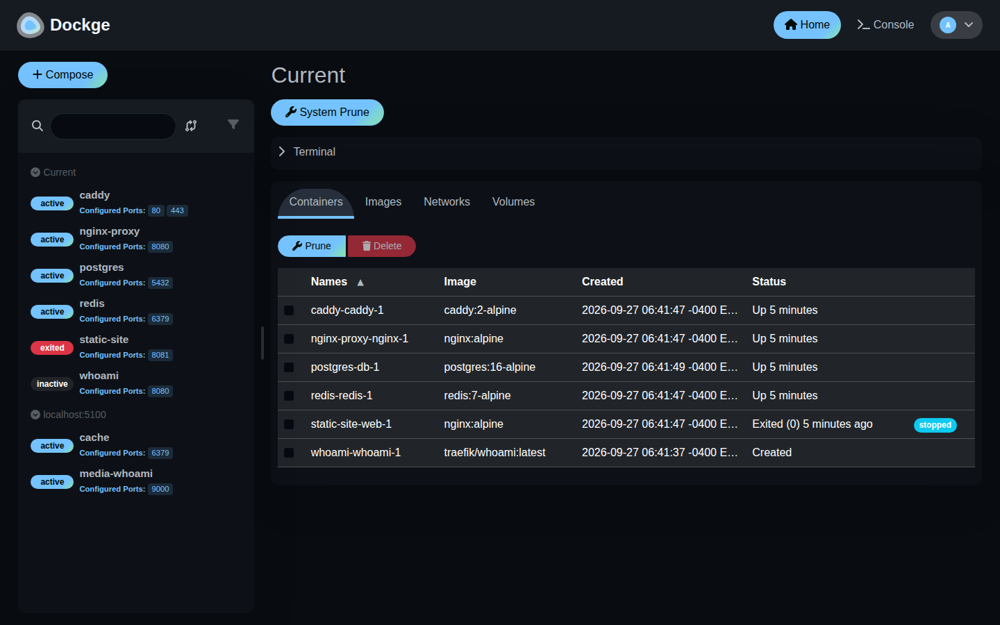<br /><b>Agent Maintenance</b></td>
    <td align="center" width="20%">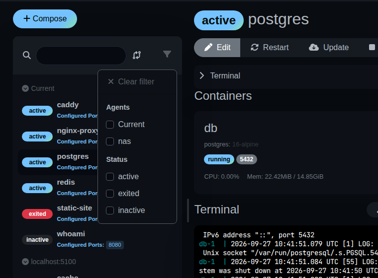<br /><b>Category filter</b></td>
  </tr>
</table>

Along the way, several pre-existing bugs in darthrater78's codebase were found and fixed by live-testing against real Docker daemons rather than trusting socket-protocol tests alone: two dangling-image detection bugs in Agent Maintenance, a missing `Terminal.vue.clearTerminal()` method that silently broke every progress-terminal call (Compose *and* Agent Maintenance pages), a broken `$root.getAgentName()` reference that prevented the Agent Maintenance page from mounting at all, a dead branch in the endpoint-display helper, and a login double-callback bug (three independent `if`s instead of if/else-if meant a stray `token` on a normal login could reach the 2FA branch and fire `callback()` twice). See `PORTING.md` and `dockge-port-tracking.md` in this repo for the full write-up, live-test methodology, and the bugs found.

**Explicitly not ported:** hamphh's skopeo-based image-update checker (darthrater78 already has a more capable version-sync/drift-check system) and hamphh's dedicated mobile UI (darthrater78 has since shipped its own full mobile redesign in 2.3.0, which this fork now includes). NekoSuneProjectsForks/dockge's container file browser (feature doesn't exist in this fork) and its own node/agent filter (redundant with the category filter above) were skipped for the same reason — nothing to port against, or already covered.

This fork is kept in sync with darthrater78/dockge via regular merges — last synced through **v2.3.1** (expandable terminal panels, security audit fixes, mobile redesign, resizable desktop stack list, fast Compose Drift Check scan, port-conflict detection from `${VAR}`/override files/ranges with a check on save/deploy), shipped as this fork's **v2.5.0**. This fork's own additions carry over into the new layout: the interactive progress terminal and Download Log button sit in the new mobile Logs tab and alongside the resizable/expandable terminal panel, and the desktop category filter coexists with upstream's port-conflict banner. Re-verified end-to-end after the merge (deploy, port-conflict dialog, download log, node-to-node transfer between two separate Docker daemons, mobile Logs tab via an agent).

---

## ⭐ Features

- 📱 (2.3.0 🆕) Mobile-first phone layout — find a stack, edit it, act on it and watch its logs, all within thumb reach ([details](#mobile))
- ↔️ (2.3.0 🆕) Resizable stack list on desktop, with port badges that fill whatever width you give it ([details](#desktop))
- 🚦 (2.3.0 🆕) Port conflict banner — every host port published by more than one running stack, and which stacks they are
- 🛑 (2.3.1 🆕) Port check on Save and Deploy — warns when a host port is already used by another stack (running or not) or a running container, including ports set through `.env` variables, `compose.override.yaml` and port ranges
- 🧑‍💼 Manage your `compose.yaml` files
  - Create/Edit/Start/Stop/Restart/Update/Delete
- ⌨️ Interactive Editor for `compose.yaml`
- 🦦 Interactive Web Terminal
- 🕷️ (1.4.0 🆕) Multiple agents support - You can manage multiple stacks from different Docker hosts in one single interface
- 🏪 Convert `docker run ...` commands into `compose.yaml`
- 📙 File based structure - Dockge won't kidnap your compose files, they are stored on your drive as usual. You can interact with them using normal `docker compose` commands
- 🧩 (1.5.1 🆕) Compose override editor - Edit `compose.override.yaml` alongside your main compose file, when present
- 🔐 (1.5.1 🆕) Optional Cloudflare Turnstile CAPTCHA on login
- 🌐 (1.6.0 🆕) REST API for external automation (CI/CD, scripts, monitoring)
- 🔄 (1.7.0 🆕) Compose Drift Check — detect and fix image tag drift between running containers and compose files (2.3.0: fast "Scan All", works on phones — [details](#drift-check))
- 🔑 (1.9.0 🆕) Two-Factor Authentication (TOTP) — protect your account with app-based 2FA
- 🐳 (Ext745/dockge 🆕) Agent Maintenance UI — manage containers, images, networks, and volumes per agent, with live terminal output
- 🙈 (Ext745/dockge 🆕) Ignore-service-status toggle — exclude specific services from a stack's aggregate status badge
- ⛶ (Ext745/dockge 🆕) Fullscreen toggle for the compose.yaml editor
- 🏷️ (Ext745/dockge 🆕) Advanced stack-list filtering by agent and status
- 🔀 (Ext745/dockge 🆕) Node-to-node stack transfer — move a stack to another connected agent from the kebab menu
- 💾 (Ext745/dockge 🆕) Download Log — save a stack's terminal output to a local file
- 📋 (Ext745/dockge 🆕) Copy-all button on every terminal — one click to copy its full output to the clipboard, with a fallback for HTTP-only instances where the browser's Clipboard API isn't available
- ⌨️ (Ext745/dockge 🆕) Raw-keystroke console — tab completion, command history and Ctrl+C work in the host Console like a real terminal


- 🚄 Reactive - Everything is just responsive. Progress (Pull/Up/Down) and terminal output are in real-time
- 🐣 Easy-to-use & fancy UI - If you love Uptime Kuma's UI/UX, you will love this one too

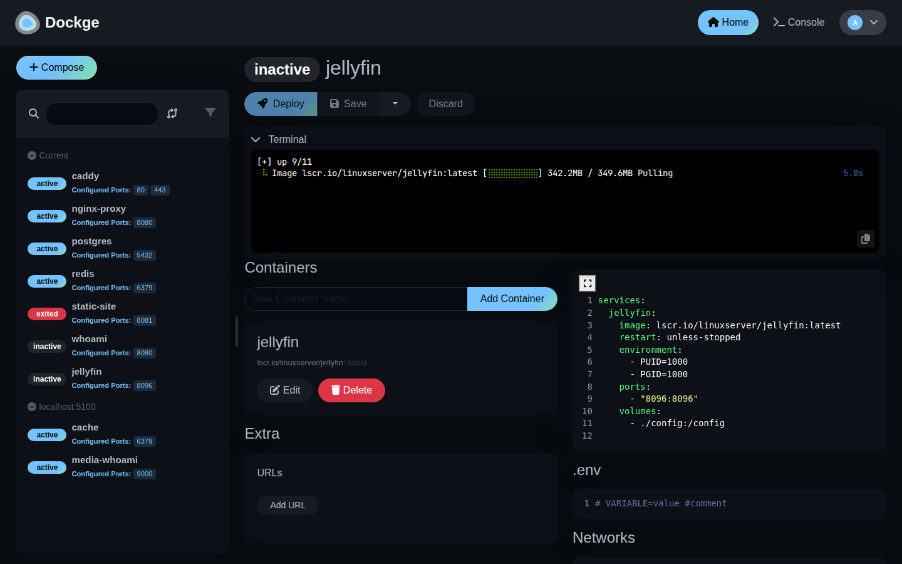

## 🔧 How to Install

Requirements:
- [Docker](https://docs.docker.com/engine/install/) 20+ / Podman
- (Podman only) podman-docker (Debian: `apt install podman-docker`)
- OS:
  - Major Linux distros that can run Docker/Podman such as:
     - ✅ Ubuntu
     - ✅ Debian (Bullseye or newer)
     - ✅ Raspbian (Bullseye or newer)
     - ✅ CentOS
     - ✅ Fedora
     - ✅ ArchLinux
  - ❌ Debian/Raspbian Buster or lower is not supported
  - ❌ Windows (Will be supported later)
- Arch: armv7, arm64, amd64 (a.k.a x86_64)

### Basic

- Compose file and Dockge's data: `/opt/docker/dockge`
- Stacks directory: `/opt/docker/stacks`
- Port: 5001

```bash
# Create the folders (needs root under /opt), make Dockge's folder yours, and go there
sudo mkdir -p /opt/docker/dockge/data /opt/docker/stacks \
  && sudo chown "$USER": /opt/docker/dockge && cd /opt/docker/dockge

# Download the compose file (saved as compose.yaml)
curl https://raw.githubusercontent.com/Ext745/dockge/master/compose.yaml --output compose.yaml

# Start Dockge
docker compose up -d
```

Dockge is now running on http://localhost:5001

Already running Dockge from another folder (such as `/opt/dockge` from older instructions)? Nothing needs to move; these paths are just the recommended layout for new installs.

### Advanced

To use a different stacks directory or port, generate a compose file with the [interactive generator](https://dockge.kuma.pet) or its URL, and save it in `/opt/docker/dockge`:

```bash
curl "https://dockge.kuma.pet/compose.yaml?port=5001&stacksPath=/opt/docker/stacks" --output compose.yaml
```

Then set its `image:` to `ghcr.io/ext745/dockge:2.5.1` (the generator uses the upstream image). To set the owner of stack files, add under `environment:` (both are needed; the default is `root`):

```yaml
      - PUID=1000
      - PGID=1000
```

### -OR- copy and paste

Save this as `/opt/docker/dockge/compose.yaml` (create the folders first: `sudo mkdir -p /opt/docker/dockge/data /opt/docker/stacks && sudo chown "$USER": /opt/docker/dockge`), then run `docker compose up -d` in that folder:

```yaml
services:
  dockge:
    image: ghcr.io/ext745/dockge:2.5.1
    restart: unless-stopped
    ports:
      - 5001:5001
    volumes:
      - /var/run/docker.sock:/var/run/docker.sock
      - /opt/docker/dockge/data:/app/data
      - /opt/docker/stacks:/opt/docker/stacks
    environment:
      - DOCKGE_STACKS_DIR=/opt/docker/stacks

# ports: 5001 is Dockge's web UI (host:container).
#   To listen on one address only: 192.168.1.10:5001:5001
# /var/run/docker.sock: lets Dockge run docker compose for your stacks
#   (root-equivalent access to Docker).
# /opt/docker/dockge/data: Dockge's database and settings (login, agents,
#   API keys). Back this folder up.
# /opt/docker/stacks: your stacks. Both sides MUST be the same full path and
#   MUST match DOCKGE_STACKS_DIR, or stack files end up in the wrong place.
# DOCKGE_STACKS_DIR: where Dockge looks for stacks (same path as above).
# Optional, under environment:
#   - PUID=1000 and - PGID=1000: owner of stack files (both needed; default root)
#   - TURNSTILE_SITE_KEY=... and - TURNSTILE_SECRET_KEY=...: CAPTCHA on login
#   - DOCKGE_ALLOW_FRAMING=true: allow embedding in a dashboard iframe
# Optional, under volumes:
#   - /root/.docker/:/root/.docker: registry logins for private images
```

## How to Update

The compose file pins a release (`ghcr.io/ext745/dockge:2.5.1`) so an update never happens by surprise.

### One-line update

Dockge can't update itself (restarting its own container would cut the update off halfway), so run this on the Docker host. Set `V` to the [latest release](https://github.com/Ext745/dockge/releases/latest):

```bash
V=2.5.1; F=/opt/docker/dockge/compose.yaml
S=; docker ps >/dev/null 2>&1 || S=sudo; $S docker pull ghcr.io/ext745/dockge:$V \
  && $S sed -i.bak -E "s#(ghcr\.io/[^/]+/dockge:)[^[:space:]]+#\1$V#" "$F" \
  && $S docker compose -f "$F" up -d dockge && $S docker compose -f "$F" ps dockge \
  && echo "✅ Dockge updated to $V" || echo "❌ Update stopped: see the error above"
```

1. **Pulls the new image first.** If that version doesn't exist, it stops before anything changes.
2. **Changes only the image tag** in your compose file, keeping the original as `compose.yaml.bak`. Ports, volumes and environment are untouched.
3. **Recreates the Dockge container** on the new image and shows its status. Your stacks keep running; only Dockge restarts.

It works from any folder, and uses `sudo` automatically if your user isn't allowed to run `docker` directly. Roll back with `mv /opt/docker/dockge/compose.yaml.bak /opt/docker/dockge/compose.yaml` and the same `docker compose -f … up -d dockge`.

**Compose file somewhere else?** Ask Docker where it was started from, and use that path as `F`:

```bash
sudo docker ps -a \
  --format '{{.Names}}  →  {{.Label "com.docker.compose.project.config_files"}}' \
  | grep -i dockge
```

### Always on the newest release

Prefer not to pin? Use `ghcr.io/ext745/dockge:latest` in your compose file, then update with:

```bash
cd /opt/docker/dockge && docker compose pull && docker compose up -d
```

## Optional: Cloudflare Turnstile CAPTCHA

To require a CAPTCHA challenge on the login page, set both of the following environment variables on the Dockge container. If either is unset, CAPTCHA verification is skipped.

```
      - TURNSTILE_SITE_KEY=<your Turnstile site key>
      - TURNSTILE_SECRET_KEY=<your Turnstile secret key>
```

Keys can be created in the [Cloudflare dashboard](https://developers.cloudflare.com/turnstile/get-started/).

## Optional: Embedding Dockge in a dashboard

By default Dockge refuses to be shown inside an iframe on another site (`X-Frame-Options: SAMEORIGIN`, `frame-ancestors 'self'`), because a page that frames it could trick you into clicking Docker actions. If you embed Dockge in a dashboard such as Home Assistant or Organizr, set:

```
      - DOCKGE_ALLOW_FRAMING=true
```

Only do this if Dockge is not reachable from untrusted networks.

## Optional: Home Assistant integration (HACS)

**[darthrater78/ha-dockge](https://github.com/darthrater78/ha-dockge)** is a custom Home Assistant integration that adds your Dockge stacks and containers to Home Assistant so you can watch and control them from there:

- A sensor for each container showing its state (running, exited, etc.), image and health
- Start, Stop, Restart and Down buttons for each stack
- `dockge.start_stack`, `dockge.stop_stack`, `dockge.restart_stack` and `dockge.system_prune` services for automations
- Support for multiple Dockge agents, each shown as its own device

**This fork is required.** The integration talks to Dockge through the [REST API](#rest-api), which the original Dockge does not have.

The integration is not in the default HACS store. Add it to HACS as a custom repository:

1. In Dockge, set an API key (`DOCKGE_API_KEY`, see [Authentication](#authentication)).
2. In HACS, open the menu (three dots, top right) and choose **Custom repositories**. Add `https://github.com/darthrater78/ha-dockge` with category **Integration**.
3. Download **Dockge** in HACS and restart Home Assistant.
4. Go to **Settings > Devices & Services > Add Integration**, search for **Dockge**, and enter your Dockge URL (for example `http://192.168.1.100:5001`) and the API key.

Use an `https://` URL where you can: the API key is sent with every request. For a dashboard card, see [Dockge Card](https://github.com/darthrater78/dockge-card).

<a id="rest-api"></a>

## REST API

*The API framework is ported from [finder39/dockge](https://github.com/finder39/dockge) ("Dockge Managed"), which wrote the original API router, auto-update scheduler and update history; it was adapted to this fork's architecture in v1.6.0.*

Dockge v1.6.0 introduces a REST API for managing stacks programmatically. The API runs on the master node only — agents do not need any changes and continue to communicate via Socket.IO.

### Authentication

All API endpoints require a static API key passed in the `X-API-Key` header.

Set your API key via environment variable:
```
      - DOCKGE_API_KEY=your-secret-api-key-here
```

Or set it at runtime through the UI/socket settings. The key is stored as a SHA-256 hash.

### Endpoints

| Method | Path | Description |
|--------|------|-------------|
| `GET` | `/api/stacks` | List all stacks (local and remote agents) |
| `GET` | `/api/stacks/:name` | Get details for a single stack |
| `POST` | `/api/stacks/:name/start` | Start a stack |
| `POST` | `/api/stacks/:name/stop` | Stop a stack |
| `POST` | `/api/stacks/:name/restart` | Restart a stack |
| `POST` | `/api/stacks/:name/update` | Pull images and restart a stack |
| `POST` | `/api/stacks/:name/down` | Tear down a stack |
| `GET` | `/api/version-sync/scan` | Scan for image tag mismatches between compose files and running containers |
| `POST` | `/api/version-sync/sync` | Sync a specific service's compose image to the running version |
| `POST` | `/api/version-sync/sync-all` | Sync all mismatched services for a stack |
| `GET` | `/api/version-sync/history` | Query version sync history with pagination |
| `POST` | `/api/version-sync/revert` | Revert a previous version sync |

### Query Parameters

**`GET /api/stacks`** and **`GET /api/stacks/:name`** accept:
- `?endpoint=hostname:port` — target a specific remote agent

**`GET /api/version-sync/scan`** accepts:
- `?stackName=mystack` — scan a specific stack (omit to scan all)
- `?endpoint=hostname:port` — target a specific remote agent

**`POST /api/version-sync/sync`** accepts JSON body:
- `stackName` (string, required) — stack to sync
- `service` (string, required) — service name within the stack
- `newImage` (string, required) — image tag to write into the compose file

**`POST /api/version-sync/sync-all`** accepts JSON body:
- `stackName` (string, required) — stack to sync all mismatches for

**`GET /api/version-sync/history`** accepts:
- `?page=1&limit=20` — pagination
- `?stackName=mystack` — filter by stack name
- `?service=myservice` — filter by service name

**`POST /api/version-sync/revert`** accepts JSON body:
- `stackName` (string, required) — stack containing the service to revert
- `service` (string, required) — service to revert to its previous image

### Example

```bash
# List all stacks
curl -H "X-API-Key: your-key" http://localhost:5001/api/stacks

# Scan all stacks for compose/running image mismatches
curl -H "X-API-Key: your-key" http://localhost:5001/api/version-sync/scan

# Scan a specific stack
curl -H "X-API-Key: your-key" "http://localhost:5001/api/version-sync/scan?stackName=myapp"

# Sync a service to its running image
curl -X POST -H "X-API-Key: your-key" -H "Content-Type: application/json" \
  -d '{"stackName":"myapp","service":"web","newImage":"nginx:1.27"}' \
  http://localhost:5001/api/version-sync/sync

# Revert a previous sync
curl -X POST -H "X-API-Key: your-key" -H "Content-Type: application/json" \
  -d '{"stackName":"myapp","service":"web"}' \
  http://localhost:5001/api/version-sync/revert
```

### Agent Compatibility

The API communicates with remote agents via Socket.IO. Agents running pre-1.6.0 versions are supported with graceful degradation:
- Stack listing falls back to legacy call signatures
- Unsupported agents are listed in the response so you know which nodes need upgrading

**Compose Drift Check requires v1.7.0 on all instances.** The master Dockge and every agent must run v1.7.0 or later for Compose Drift Check to work. The scan and sync commands are registered as new socket events (`scanVersionSync`, `syncVersion`, `syncAllVersions`, `revertVersionSync`) — agents running older versions will not respond to these events. The global scan on the Home page (on phones: ☰ → Compose Drift Check, or the button beside the stack search) only contacts agents that are online; offline or pre-1.7.0 agents are skipped with a warning.

**Save/Deploy port check (v2.3.1):** a web UI check (the REST API deploys without it). It runs on the agent that owns the stack (new socket event `checkPortConflicts`). An agent older than 2.3.1 does not answer it, so the save goes ahead after 5 seconds without a warning.

**Agent credential encryption (v1.9.0):** Agent passwords are now encrypted at rest using AES-256-GCM. A one-time migration encrypts existing plaintext passwords on first startup. Remote agents do not need updating — the wire protocol is unchanged. However, rolling back the primary to a pre-1.9.0 version after migration will break agent authentication; back up the SQLite database before upgrading.

## Version History

This fork's own changes are listed in the "This fork — Ext745/dockge" section near the top of this README. For the full darthrater78 version history (v1.5.1 through v2.3.1), see [their README](https://github.com/darthrater78/dockge/blob/master/README.md#version-history).

## Screenshots

<table>
  <tr>
    <td align="center" width="50%">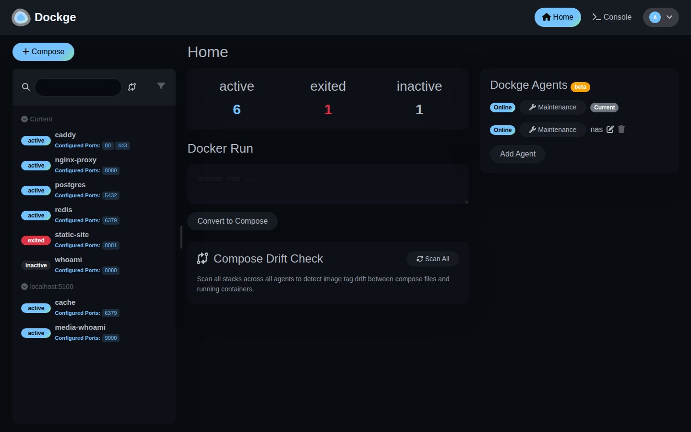<br /><b>Home</b> — status counts, agents, Compose Drift Check</td>
    <td align="center" width="50%">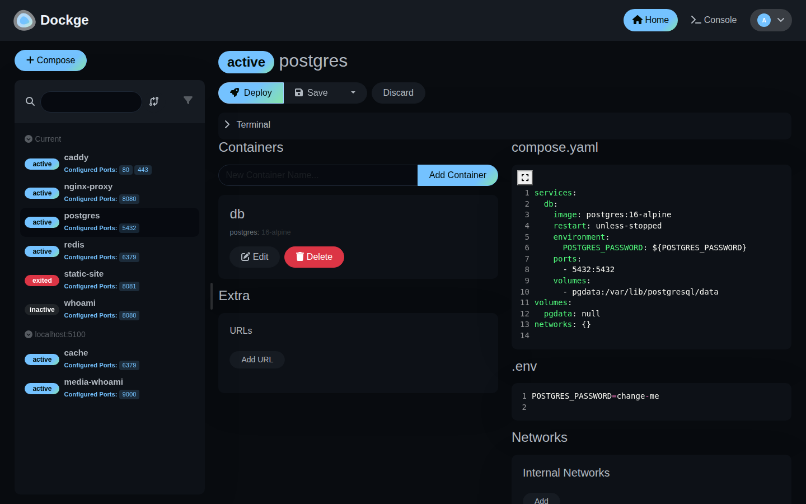<br /><b>Edit</b> — compose.yaml, .env, containers, networks</td>
  </tr>
  <tr>
    <td align="center">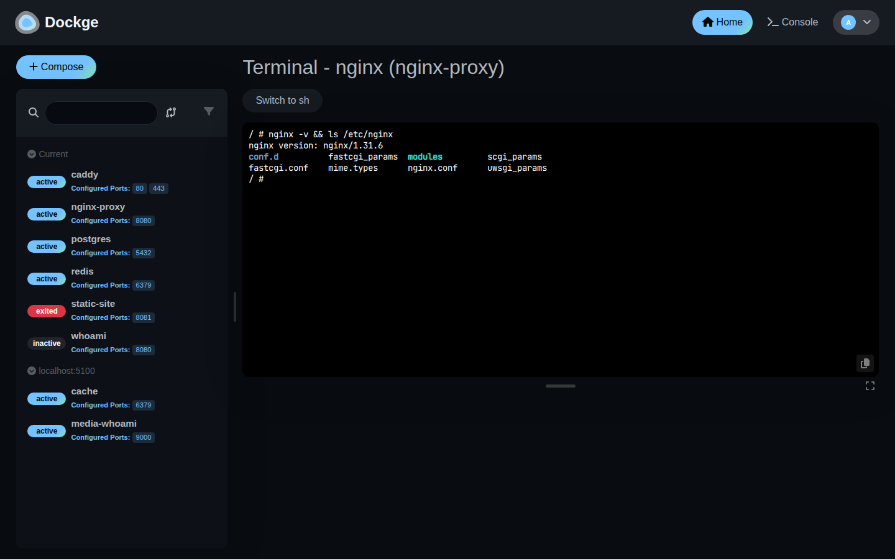<br /><b>Container shell</b></td>
    <td align="center">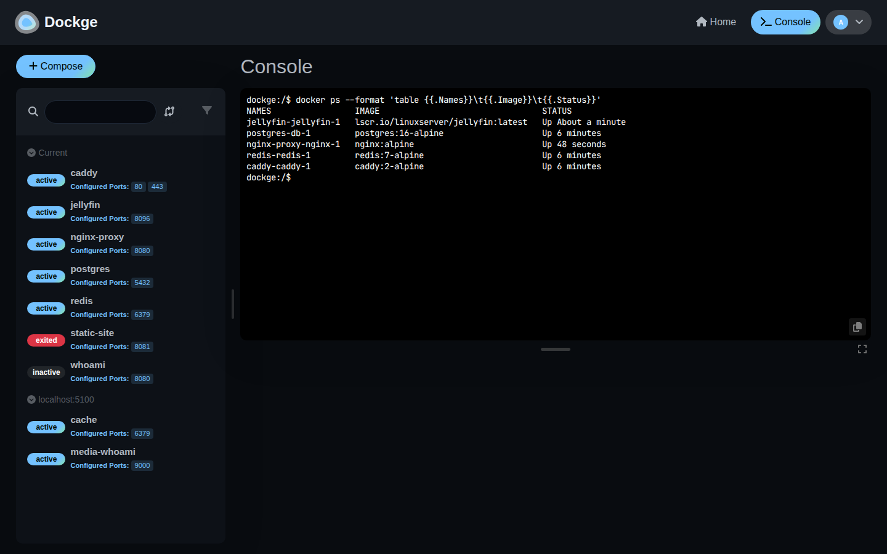<br /><b>Console</b> (with <code>DOCKGE_ENABLE_CONSOLE=true</code>)</td>
  </tr>
</table>

## Motivations

*From Louis Lam's original README:*

- I have been using Portainer for some time, but for the stack management, I am sometimes not satisfied with it. For example, sometimes when I try to deploy a stack, the loading icon keeps spinning for a few minutes without progress. And sometimes error messages are not clear.
- Try to develop with ES Module + TypeScript

If you love this project, please consider giving it a ⭐.


## 🗣️ Community and Contribution

### Bug Reports and Help
This fork doesn't run its own issue tracker or discussion board. Almost all of Dockge's code comes from upstream, so report bugs and ask questions at [darthrater78/dockge](https://github.com/darthrater78/dockge/issues) (this fork's base), or [louislam/dockge](https://github.com/louislam/dockge/issues) for the original project. Please check that the problem also happens on their release, since this fork's own additions (listed under "This fork — Ext745/dockge" above) aren't theirs to support.

### Security Issues
Please report privately: https://github.com/Ext745/dockge/security/advisories/new

### Translation
If you want to translate Dockge into your language, please read [Translation Guide](https://github.com/Ext745/dockge/blob/master/frontend/src/lang/README.md)

### Create a Pull Request

Be sure to read the [guide](https://github.com/Ext745/dockge/blob/master/CONTRIBUTING.md), as we don't accept all types of pull requests and don't want to waste your time.

## FAQ

#### "Dockge"?

"Dockge" is a coinage word which is created by myself. I originally hoped it sounds like `Dodge`, but apparently many people called it `Dockage`, it is also acceptable.

The naming idea came from Twitch emotes like `sadge`, `bedge` or `wokege`. They all end in `-ge`.

#### Can I manage a single container without `compose.yaml`?

The main objective of Dockge is to try to use the docker `compose.yaml` for everything. If you want to manage a single container, you can just use Portainer or Docker CLI.

#### Can I manage existing stacks?

Yes, you can. However, you need to move your compose file into the stacks directory:

1. Stop your stack
2. Move your compose file into `/opt/docker/stacks/<stackName>/compose.yaml` (your `DOCKGE_STACKS_DIR`)
3. In Dockge, click the " Scan Stacks Folder" button in the top-right corner's dropdown menu
4. Now you should see your stack in the list

#### Is Dockge a Portainer replacement?

Yes or no. Portainer provides a lot of Docker features. While Dockge is currently only focusing on docker-compose with a better user interface and better user experience.

If you want to manage your container with docker-compose only, the answer may be yes.

If you still need to manage something like docker networks, single containers, the answer may be no.

#### Can I install both Dockge and Portainer?

Yes, you can.

## Others

Dockge is built on top of [Compose V2](https://docs.docker.com/compose/migrate/). `compose.yaml`  also known as `docker-compose.yml`.
